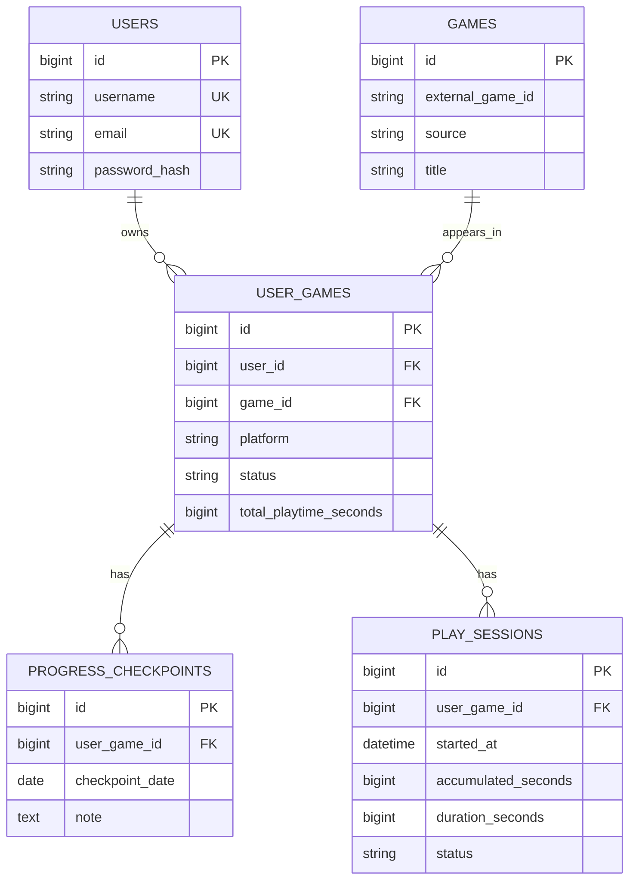

# Checkpoint

Checkpoint is a Material 3 Flutter game-backlog tracker backed by Express and MySQL. It supports JWT authentication, per-user backlogs, RAWG search, manual covers, progress checkpoints, accurate play timers, and session history.

## Architecture

```text
Flutter mobile ──REST/JWT──> Node.js + Express ──> MySQL
                                  └─────────────> RAWG API
```

Flutter remains at the project root. `backend/` is the API and upload server; `database/` contains SQL. Flutter never connects directly to MySQL or RAWG.

## ERD



The InnoDB/utf8mb4 schema uses foreign keys, parameterized queries, cascading user-owned children, and `UNIQUE(user_id, game_id, platform)`.

## API

Except registration, login, and `/health`, routes require `Authorization: Bearer <JWT>`.

| Area | Endpoints |
|---|---|
| Auth | `POST /api/auth/register`, username/email checks, `POST /api/auth/login`, `GET /api/auth/me`, `POST /api/auth/logout` |
| Backlog | `GET/POST /api/backlog`, `GET/PUT/DELETE /api/backlog/:id` |
| Games | `GET /api/games/search?q=`, `GET /api/games/external/:externalId` |
| Upload | `POST /api/uploads/game-cover` using multipart field `cover` |
| Checkpoints | `GET/POST /api/backlog/:userGameId/checkpoints`, `GET/PUT/DELETE /api/checkpoints/:id` |
| Sessions | start/list under `/api/backlog/:userGameId/sessions`; active/get/pause/resume/finish under `/api/sessions` |

Every backlog, checkpoint, and session query includes the authenticated user ID. Passwords use bcrypt; JWTs expire after seven days and are kept in Flutter secure storage. RAWG responses are reduced to ID, title, cover, date, and platforms. Manual add works without a RAWG key.

## Timer and transaction

Backend timestamps are the source of truth: running elapsed time is `NOW - started_at + accumulated_seconds`. Flutter's periodic timer only refreshes the display and resynchronizes `/api/sessions/active` after lifecycle resume.

The finish transaction is in `backend/src/controllers/session.controller.js`. It obtains a connection, begins a transaction, locks the session with `FOR UPDATE`, updates the session and aggregate playtime, optionally inserts the progress checkpoint, then commits. Any error rolls back, and the connection is always released.

## Installation

Requirements: Flutter, Node.js 18+, npm, and MySQL 8+.

```bash
mysql -u root -p < database/schema.sql
mysql -u root -p < database/seed.sql
cd backend
cp .env.example .env
npm install
npm run dev
```

Configure `.env`: `DB_HOST`, `DB_PORT`, `DB_USER`, `DB_PASSWORD`, `DB_NAME`, a strong `JWT_SECRET`, and optionally `RAWG_API_KEY`. Express serves cover files from `backend/uploads/game-covers`.

For an Android emulator:

```bash
flutter pub get
flutter run --dart-define=API_BASE_URL=http://10.0.2.2:3000
```

For a physical Android device on the same network, use the computer's LAN address (and allow port 3000 through its firewall):

```bash
flutter run --dart-define=API_BASE_URL=http://192.168.x.x:3000
```

`localhost` on a phone points to the phone, not the development computer. The default base URL is emulator-safe and can always be overridden with `API_BASE_URL`.

## Verification

```bash
dart format .
flutter analyze
flutter test
cd backend && npm run check
```

End-to-end API verification requires a reachable MySQL instance; RAWG search also requires a valid key.
